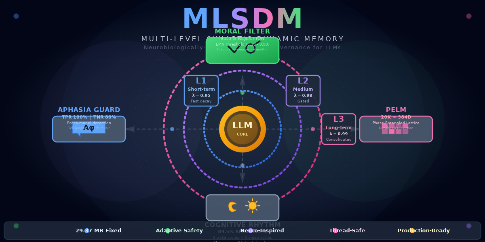

# MLSDM (Multi-Level Synaptic Dynamic Memory)



[](https://github.com/neuron7x/mlsdm/actions/workflows/ci-smoke.yml)
[](https://github.com/neuron7x/mlsdm/actions/workflows/prod-gate.yml)
[](https://github.com/neuron7x/mlsdm/actions/workflows/perf-resilience.yml)
[](https://github.com/neuron7x/mlsdm/actions/workflows/property-tests.yml)
[](https://github.com/neuron7x/mlsdm/actions/workflows/sast-scan.yml)
[](https://www.python.org/downloads/)
[](LICENSE)

## What It Is

MLSDM is a production-ready, neurobiologically-grounded cognitive architecture with moral governance. It provides a governed cognitive memory system with a circadian wake/sleep rhythm, multi-level memory (L1/L2/L3), moral filtering, and aphasia detection. The system exposes an HTTP API, a Python library, and a CLI entrypoint for integration with LLM applications.

## Repository Map

| Path | Description |
|------|-------------|
| `src/mlsdm/` | Core implementation |
| `tests/` | Test suite (unit, integration, validation) |
| `docs/` | Documentation (see [INDEX.md](docs/INDEX.md)) |
| `scripts/` | Validation and maintenance scripts |
| `config/` | Configuration files |
| `.github/workflows/` | CI definitions |

**Key Entry Points:**
- 📖 **[docs/INDEX.md](docs/INDEX.md)** — Navigation hub for all documentation
- 🏗️ **[docs/ARCHITECTURE_SPEC.md](docs/ARCHITECTURE_SPEC.md)** — System architecture
- 📋 **[docs/GOVERNANCE.md](docs/GOVERNANCE.md)** — Governance rules and enforcement
- 📊 **[docs/INVENTORY.md](docs/INVENTORY.md)** — Governed paths inventory

## Quick Start

### Install

```bash
# Using uv (recommended, uses uv.lock)
uv sync

# Or using pip
pip install -e ".[dev]"
```

### Start the Server

```bash
mlsdm serve --host 0.0.0.0 --port 8000
```

### API Usage

```bash
# Health check
curl http://localhost:8000/health

# Generate a governed response
curl -X POST http://localhost:8000/generate \
  -H "Content-Type: application/json" \
  -d '{"prompt": "Hello, how are you?"}'
```

## SSOT Validation Gates

Run these commands to validate repository governance:

```bash
# Run SSOT validation (bibliography + claims)
make ssot

# Run smoke tests (fast feedback)
make test-smoke

# Run validation tests
make test-validation

# Run full local CI (SSOT + smoke)
make ci-local
```

## Quality Gates (CI Parity)

These commands match what CI runs:

```bash
make lint           # Run ruff linter on src and tests
make type           # Run mypy type checker on src/mlsdm
make test           # Run all tests (uses pytest.ini config)
make test-fast      # Run fast unit tests (excludes slow/comprehensive)
make coverage-gate  # Run coverage gate (default threshold: 75%)
```

The `coverage_gate.sh` script enforces the coverage threshold (default `COVERAGE_MIN=75`).

## Interfaces

### Python Library

```python
from mlsdm import create_llm_wrapper

wrapper = create_llm_wrapper(
    wake_duration=8,
    sleep_duration=3,
    initial_moral_threshold=0.5,
)
result = wrapper.generate(prompt="Hello", moral_value=0.8)
```

### HTTP API

The HTTP API is served via FastAPI with interactive docs at `/docs` and `/redoc`.

**Endpoints:**
- `POST /generate` — Generate governed response
- `POST /infer` — Extended inference with governance options
- `GET /health` — Simple health check
- `GET /health/live` — Liveness probe
- `GET /health/ready` — Readiness probe
- `GET /status` — Extended service status

### CLI

```bash
mlsdm info      # Show version, status, and configuration
mlsdm serve     # Start the HTTP API server
mlsdm demo -i   # Interactive demo
mlsdm check     # Check environment and configuration
mlsdm eval      # Run evaluation scenarios
```

## Verified Contracts & Evidence

Authoritative, evidence-backed contracts:

- [docs/CONTRACTS_CRITICAL_SUBSYSTEMS.md](docs/CONTRACTS_CRITICAL_SUBSYSTEMS.md) — Critical subsystem contracts
- [docs/CLAIM_EVIDENCE_LEDGER.md](docs/CLAIM_EVIDENCE_LEDGER.md) — Configuration/security claims with enforcement status
- [docs/CLAIMS_TRACEABILITY.md](docs/CLAIMS_TRACEABILITY.md) — Performance/effectiveness metrics with test mapping

**Verification commands:**

```bash
make verify-docs           # Verify documentation contracts against code
make verify-security-skip  # Verify security skip path invariants
```

Evidence snapshots are produced by the `readiness-evidence.yml` workflow and stored under `artifacts/evidence/`.

## Documentation

**Navigation Hub:** [docs/INDEX.md](docs/INDEX.md)

**Key Documents:**
| Document | Purpose |
|----------|---------|
| [docs/USAGE_GUIDE.md](docs/USAGE_GUIDE.md) | Usage examples and best practices |
| [docs/API_REFERENCE.md](docs/API_REFERENCE.md) | Complete API documentation |
| [docs/ARCHITECTURE_SPEC.md](docs/ARCHITECTURE_SPEC.md) | System architecture |
| [docs/CONFIGURATION_GUIDE.md](docs/CONFIGURATION_GUIDE.md) | Configuration reference |
| [docs/DEPLOYMENT_GUIDE.md](docs/DEPLOYMENT_GUIDE.md) | Production deployment patterns |
| [docs/SECURITY_POLICY.md](docs/SECURITY_POLICY.md) | Security guidelines |
| [docs/GOVERNANCE.md](docs/GOVERNANCE.md) | Governance and validation |
| [docs/status/READINESS.md](docs/status/READINESS.md) | Canonical readiness truth |

## Contributing

See [CONTRIBUTING.md](CONTRIBUTING.md).

## License

[MIT](LICENSE)
